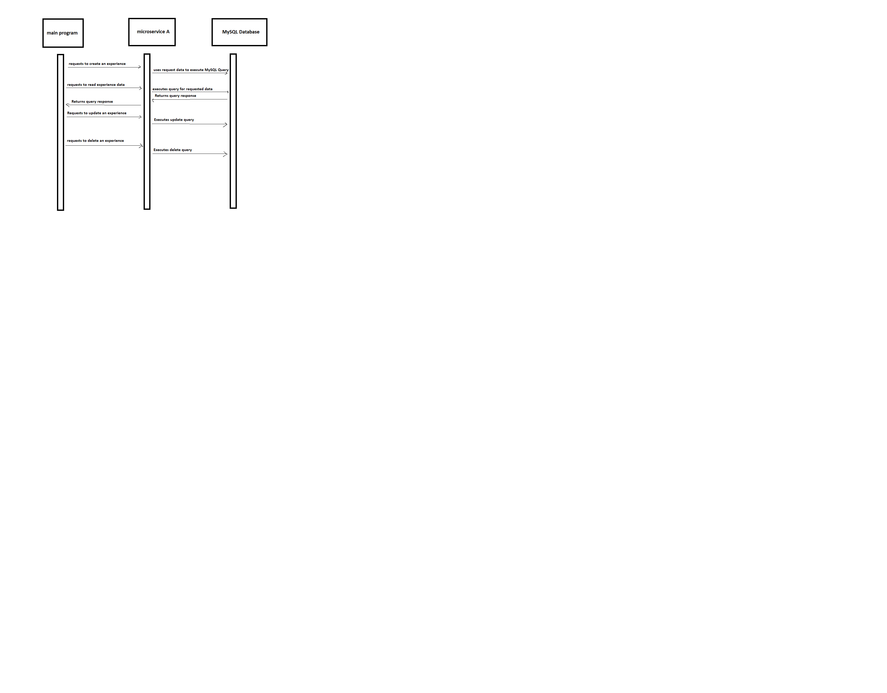

# Program Description  
A REST API microservice which performs CRUD operations for a MySQL database. Developed per teammate's elicited requirements.

## Database:  
- See "/database/DDL.sql" for the database definitions for the Experiences table
- How to connect to your database:
    - Open "/database/db_connector.py" file and update the values for variable usr, psswd, and db to the information for your database. 
    - "host" variable is already filled in for OSU engineering MySQL servers. 

## Dependencies:
    Python 3.12
    Flask
    MySQLdb
    recommended: requests (used for the test program and example calls)

## How to call the microservice:
    1. Locate the SERVER_ADDRESS and PORT_NUMBER for the REST API URL, which may be changed in data_retreival_microservice.py file. Default is 127.0.0.1:8101.
    2. Update db_connector.py with database credentials
    3. CRUD Operations:
        - Create: POST to URL/add_experience. Requires null values to be present as an empty string for.  
            ```request_form = {"rating": "5", "details":"", "image":"", "userID":"1"}  
            requests.post("http://127.0.0.1:8101/add_experience", json=request_form)```
        - Read All: GET to URL/experiences. To request and receive data, assign the get request to a variable and call json() on it:  
            ```response = requests.get('http://127.0.0.1:8101/experiences')  
            process_received_data(response.json())```
        - Read One: GET to URL/experiences/<experienceID>  
            ```response = requests.get('http://127.0.0.1:8101/experiences/1')```
        - Update: POST to URL/update_experience. Requires null values to be present as an empty string.  
            ```request_form = {"rating": "5", "details":"New details", "image":"", "userID":"1"}  
            requests.post("http://127.0.0.1:8101/update_experience/1", json=request_form)```
        - Delete: Empty Post to URL/delete_experience/<experienceID>  
            ```Contains error handling for experience ID not found, returning <Response [400]>  
            database_update = requests.post("http://127.0.0.1:8101/delete_experience/2")```


## UML Diagram: 

